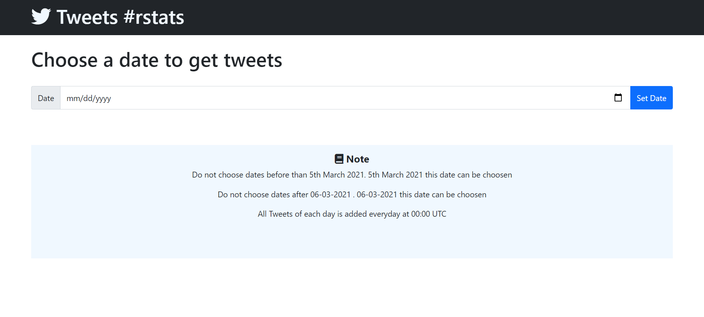

# tweetdayR
This app fetches tweets containing #rstats from twitter

# Live app
https://patelaryan7751.github.io/tweetdayR/frontend/

All tweets fetched by this script are displayed in this app.

# App worflow
The script available in index.js fetches tweets from twitter api and stores it all in firebase realtime database at 00:00 UTC with continous integration with github action.

The frontend folder conatins code to display all tweets stored in firebase database by the script.

# Some flaws in app
As mentioned in github action documentation that there is no sureity that the scheduled job would be executed on the scheduled time. So storing of new tweets by the script gets delayed due to this.

link of docs- https://docs.github.com/en/actions/reference/workflow-syntax-for-github-actions#onschedule

